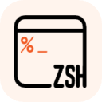
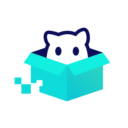
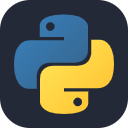

    

        
    

    <h1>
        Hi, I'm 🧶.
    </h1>
    
A student of INIAD, and A representative of INIAD.ts.

 

## Environment ⚗️

     

 

## Skills 🍹

        

 

## Stats 🌡️

 

<h2>
    About avatar
    <ruby>
        
        <rp>(</rp><rt><i><b>kawaii</b></i></rt><rp>)</rp>
    </ruby>
</h2>
<i>This avatar was illustrated by <a href='https;//twitter.com/4y4san'>4y4san</a>.🎨</i>
